🍽️ Test of Addis — Food Ordering Web App

Test of Addis is a modern, responsive food ordering web application that showcases Ethiopian cuisine.
Users can browse food menus, add items to cart, authenticate securely, and place orders through a smooth and intuitive UI.

✨ Features
🍲 Browse food menu
🛒 Add / remove items from cart
🧩 track orders
🔐 Authentication with NextAuth
📱 Fully responsive design
⚡ Fast and optimized UI
🔄 Real-time data with GraphQL
🧩 Auto-generated types using GraphQL Codegen

🛠️ Tech Stack
Frontend
Next.js
ShadCN UI
Tailwind CSS
NextAuth
GraphQL Code Generator
Backend
Hasura
GraphQL
PostgreSQL
Docker

🏗️ Project Architecture
Frontend (Next.js)
│
│ GraphQL
▼
Hasura Engine
│
PostgreSQL Database

🔐 Authentication
Authentication is handled using NextAuth, providing:
Secure session management
JWT-based authentication
Integration with backend APIs

📦 Installation & Setup
1️⃣ Clone the Repository
https://github.com/Jemal-Abdulkadir59/test-of-addis.git
cd test-of-addis

2️⃣ Install Dependencies
pnpm install

4️⃣ Run the App
pnpm dev

🐳 Docker Setup (Backend)
docker-compose up -d

🧬 GraphQL Codegen
Generate types automatically:
pnpm run codegen

📸 Screenshots

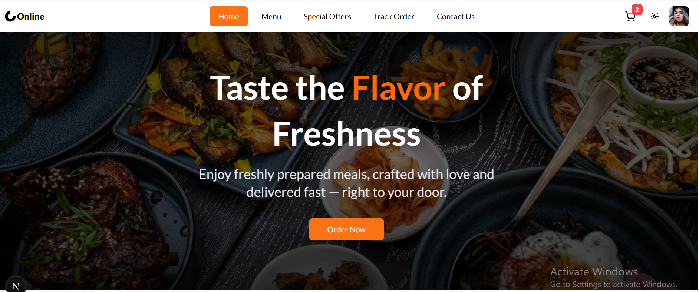

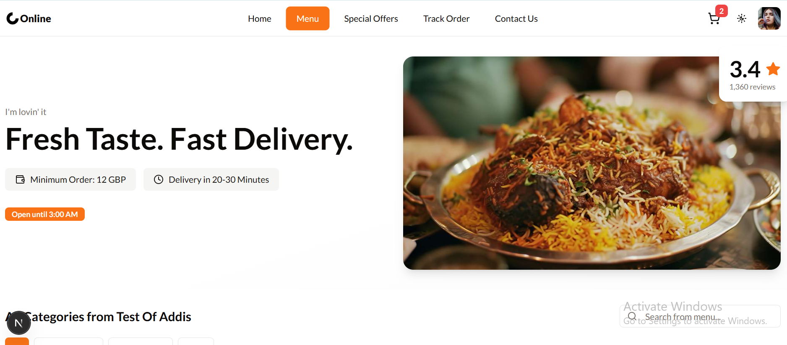
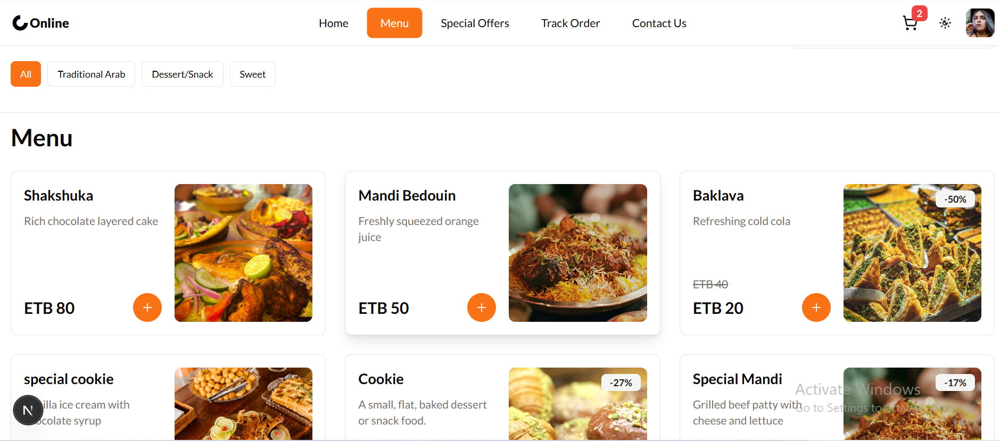
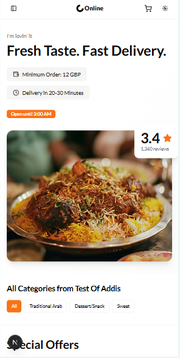
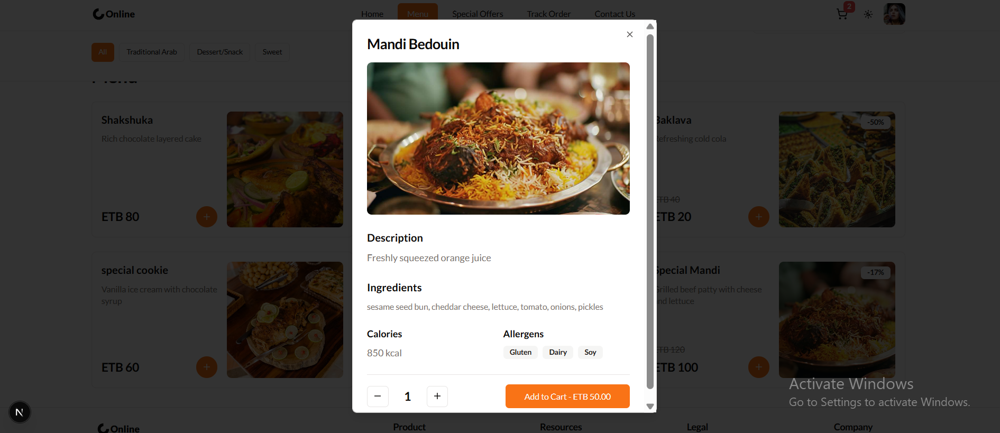
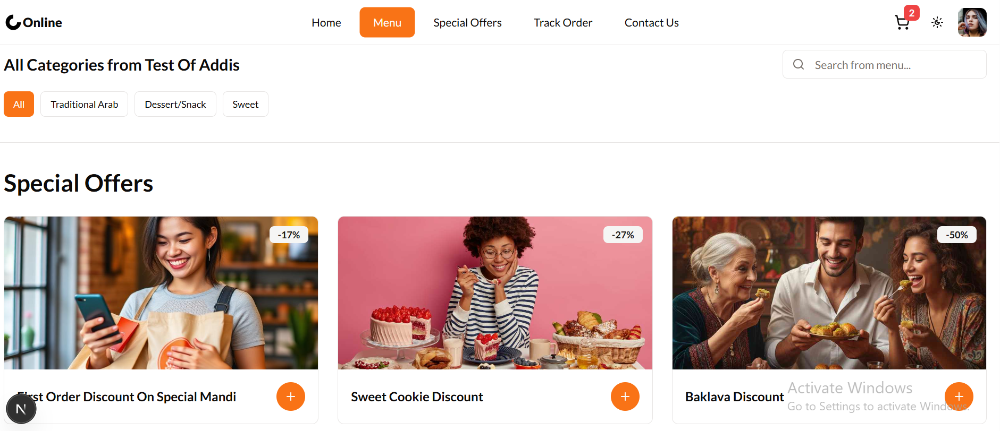
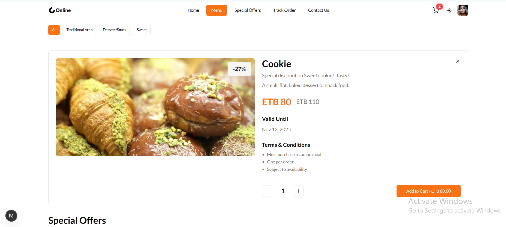
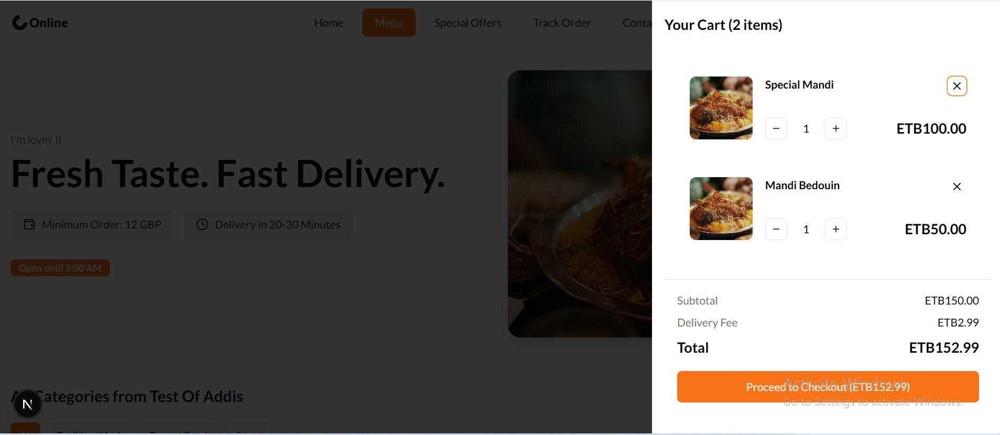
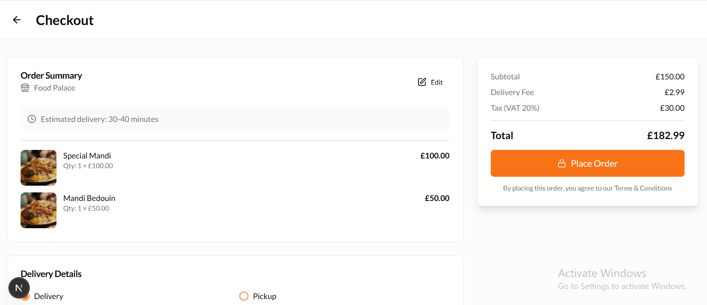
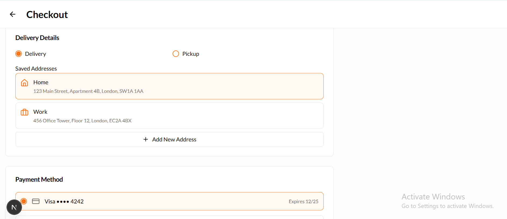
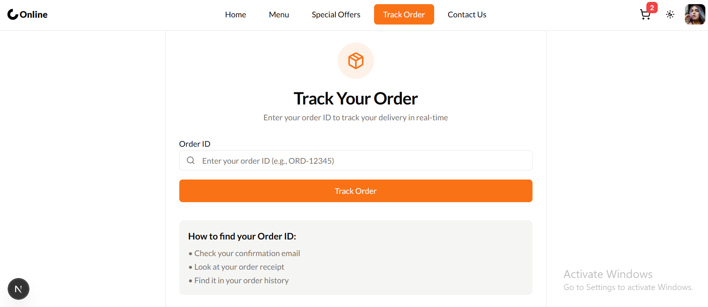
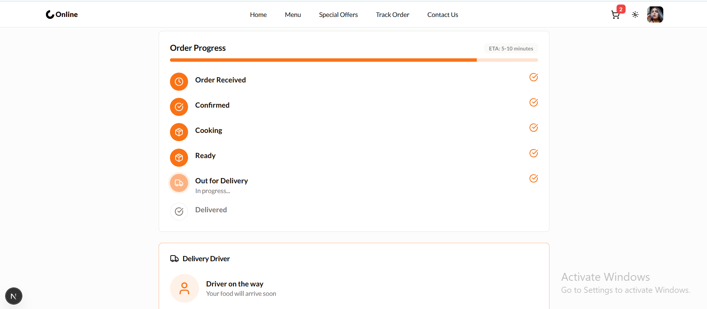

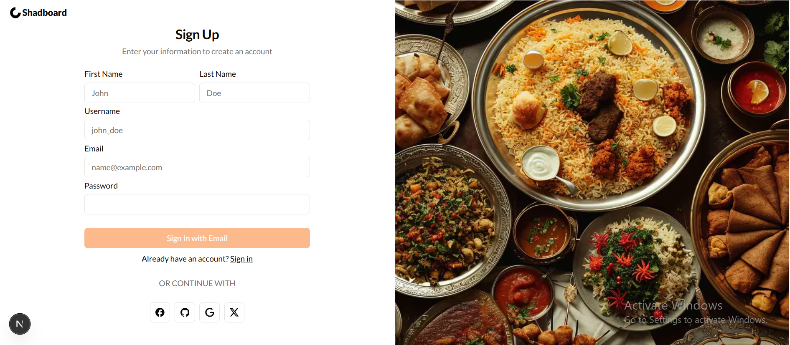
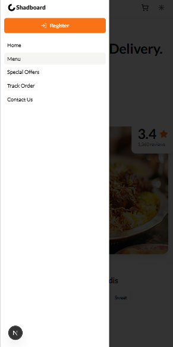
